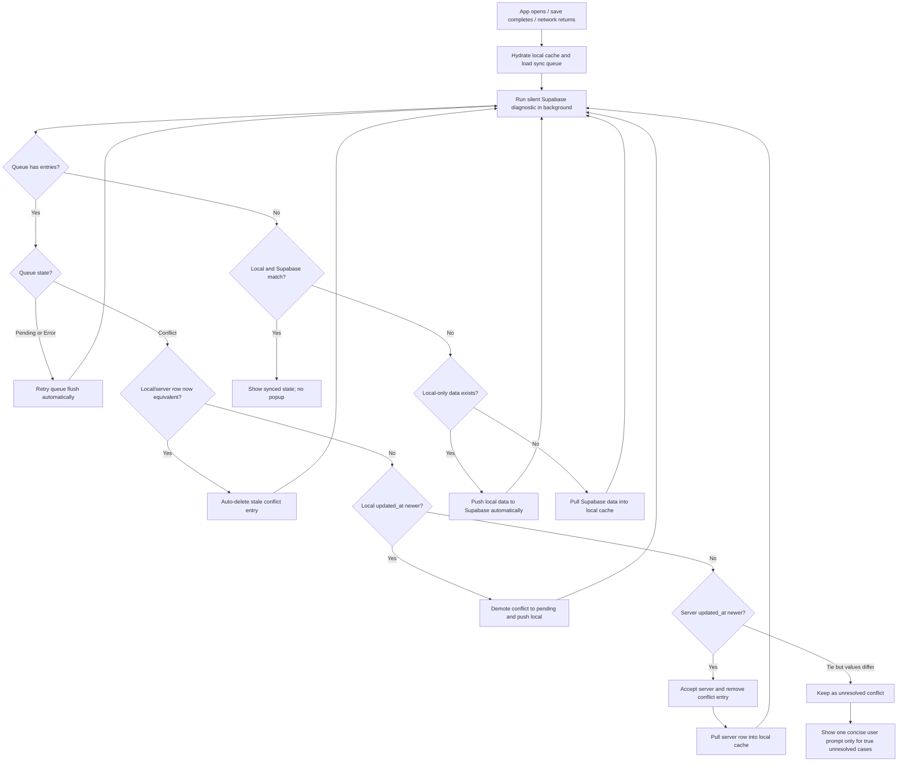

# Auto Sync Conflict Resolution Procedure

This procedure defines how the app should handle local-first Supabase sync conflicts without asking the user to resolve hundreds of queue entries manually.

## Objective

- Save locally first and keep the UI responsive.
- Sync to Supabase in the background.
- Clean stale queue conflicts automatically when local and server data already match.
- Use deterministic Last Write Wins behavior for ordinary single-user multi-device conflicts.
- Show a user-facing conflict prompt only when the app cannot safely decide.

## Scope

This applies to:

- `sync_queue_<userId>` entries in `localStorage`
- `PENDING`, `ERROR`, and `CONFLICT` queue states
- Supabase tables: `clinics`, `shifts`, `user_lists`, `hanging_fees`
- Diagnostic checks comparing local cache with Supabase
- Manual force-sync actions such as `syncLocalToSupabase()`

## Standard Flow

## Procedure

1. Hydrate local cache before any network pull.
2. Load the per-user sync queue from `sync_queue_<userId>`.
3. Fetch Supabase rows for the current user.
4. Build comparable maps for local and server rows using stable keys:
   - `clinics`: `id`
   - `shifts`: `shift_date`
   - `user_lists`: `list_name`
   - `hanging_fees`: `year_month`
5. For each queue entry:
   - If state is `PENDING` or `ERROR`, retry via normal queue flush.
   - If state is `CONFLICT`, compare the queued payload with the current server row.
6. For each `CONFLICT`:
   - If local and server are equivalent, delete the queue entry.
   - If local `updated_at` is newer, change state to `PENDING` and push local.
   - If server `updated_at` is newer, remove the queue entry and pull server into local.
   - If timestamps tie but values differ, keep the entry as unresolved.
7. Re-run diagnostics after cleanup/push/pull.
8. Show user UI only if unresolved conflicts remain.

## Equivalence Rule

Equivalent means the app-level values match, not necessarily byte-for-byte JSON order. For example, JSONB arrays/objects may be returned by PostgREST in a different key order. Comparison helpers should normalize known scalar fields and avoid false positives from serialization order.

## User Experience

Normal user-facing statuses:

- `บันทึกแล้ว`
- `กำลัง sync...`
- `sync สำเร็จ`
- `รออินเทอร์เน็ต`
- `ยังไม่มีเน็ตอย่าปัด App ทิ้งนะงับ`

Avoid showing large raw queue counts during normal operation. Diagnostic UI may show counts for support/debug only.

## Safety Rules

- Never delete app data from local cache just to clear a queue.
- Never drop `PENDING` writes unless the equivalent server row is already present.
- Never block saving on a Supabase request.
- Always preserve a path to export JSON before destructive manual recovery.
- Prefer automatic cleanup for stale conflicts over user confirmation loops.

## Acceptance Criteria

- A stale conflict queue of hundreds of entries can clear without user tapping each one.
- If local/server data already match, conflicts disappear automatically.
- If local has unsynced changes, they are pushed automatically when online.
- If server is newer, local cache is updated automatically.
- User sees a prompt only for true unresolved conflicts.
